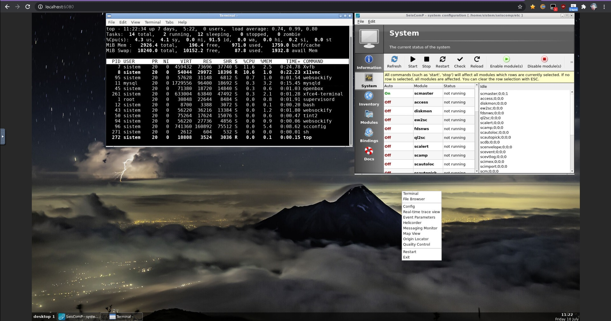

# Docker Seiscomp

Run Seiscomp with easy steps (base ubuntu)



## How to Use!

Use docker to run it (VolcanoYT Repo requires a password, please ask me first)

```bash
docker run --rm -it -p 6080:6080/tcp repo.volcanoyt.com/docker-seiscomp:last
```

or please build it manually so you can use it without a password :)

```bash
docker build -t "docker-seiscomp:last" -f Dockerfile .
```

- Web Remote: http://localhost:6080 with password "demo" and sql server with "demo" (Tips preferably using a separate sql server with other containers.)

## Contributing
Pull requests are welcome. For major changes, please open an issue first to discuss what you would like to change.

Please make sure to update tests as appropriate.

```bash
git clone https://github.com/volcanoyt/Docker-Seiscomp.git
docker build -t "repo.volcanoyt.com/docker-seiscomp:last" -f Dockerfile .
docker push repo.volcanoyt.com/docker-seiscomp:last
```

## License
Program based [AGPL](https://www.seiscomp.de/license/) but this project [MIT](https://choosealicense.com/licenses/mit/)